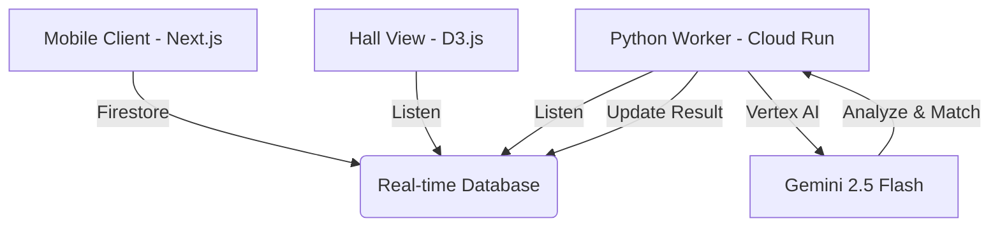

# 🚀 Nexus Connect

<details>
<summary>🇬🇧 English</summary>

## 🌍 Brand New "Hello World."
**Social Networking: Evolution through AI-Driven Authenticity.**

Yesterday's "Hello World" was a static line of code. Today's "Hello World" is the spark of a new human connection. **Nexus Connect** redefines the first interaction at events by transforming cold introductions into a live, AI-mapped social ecosystem. We don't just help you meet people; we visualize the threads of potential friendship before you even speak.

## 🧠 Concept & Story
Networking at professional events or hackathons often feels like a sequence of scripted, surface-level exchanges. We wanted to lower the "Activation Energy" of social interaction. 

The motivation is simple: **Loneliness in a crowded room is a solvable engineering problem.** By using AI to analyze personas and D3.js to visualize the "Social Fabric" in real-time, we create a playground where curiosity outweighs social anxiety.

## 💡 What Makes This "Brand New"
*   **The Vibe-to-Vector Paradigm**: Instead of static profiles, we use multimodal AI to turn a single selfie or a mood into a high-dimensional persona vector.
*   **Live Social Fabric**: A real-time D3.js network graph that grows as people join, showing physical and intellectual proximity.
*   **AI-Forged Identity**: Your "Animal Spirit" and personalized avatars (Nano-Banana) create a fun, low-pressure entry point into serious networking.

## 🛠️ Product Overview
Nexus Connect is a dual-view social orchestration platform.
*   **Event Hall View (Desktop)**: A stunning, real-time D3.js visualization of every participant and their emerging connections.
*   **User View (Mobile)**: A seamless onboarding flow that uses Gemini to analyze your "vibe" and generates 3 custom ice-breaker topics for every match.

## 🎬 Demo Flow (CRITICAL)
1.  **Host Entry**: The host opens the Hall View on a large screen, displaying a unique QR code.
2.  **Participant Join**: Users scan the QR code to join the room on their phones.
3.  **Vibe Selection**: Users choose between "Mood Mode" (emoji-based) or "Camera Mode" (AI-multimodal analysis).
4.  **AI Ice-Breaking**: Gemini generates 3 tailored questions based on your persona.
5.  **Persona Forging**: Upon answering, our AI "Forges" your final profile, assigning you a unique AI animal avatar.
6.  **Social Graph**: Instantly, you appear on the big screen! Lines of "Affinity" connect you to the most compatible people in the room.
7.  **Match Card**: Your phone displays your best matches with 3 AI-generated conversation topics to start the chat.

## ⚙️ Technical Architecture

*   **Frontend**: React/Next.js, Tailwind CSS, Framer Motion.
    *   **Backend**: Python FastAPI (Cloud Run) orchestrating AI logic.
    *   **Infrastucture**: Google Cloud Platform (Firestore, Firebase Storage, Cloud Run).

## 🤖 Google Tech Usage (VERY IMPORTANT)
*   **Gemini 2.5 Flash (Vertex AI)**: Used for high-speed, multimodal vibe analysis and profile forging. It's not just a chatbot; it's our "Social Engine" calculating affinity scores.
*   **Cloud Run**: Provides serverless, auto-scaling power for our Python worker that processes global matching algorithms.
*   **Firestore**: The backbone of the real-time experience. Every data join in D3.js is powered by a Firestore listener, ensuring sub-second updates to the social graph.

## 📈 Scalability & Robustness
*   **Concurrency**: Our Python worker uses a threaded executor to handle multiple participant "forging" requests simultaneously.
*   **Cleanup**: Automatic room lifecycle management ensures transient data is purged after the event.
*   **Edge Cases**: Fallback avatars and "General" ice-breakers ensure the experience remains fluid even under high latency.

## 🌐 Deployment & Reproducibility
1.  **Frontend**: Deployed on Firebase Hosting.
    ```bash
    npm run build && firebase deploy
    ```
2.  **Backend**: Deployed on Google Cloud Run.
    ```bash
    gcloud run deploy ice-breaker-backend --source .
    ```
3.  **Environment**: Requires `GEMINI_API_KEY` and Firebase config.

## 🧪 Technical Challenge & Difficulty
*   **Real-time D3.js Data Joins**: Synchronizing a complex force-directed graph with a real-time database while maintaining 60FPS.
*   **Multimodal Consistency**: Ensuring Gemini understands the "Vibe" of a photo and translates it into a stable personality vector (OCEAN).

## 🧬 “Outlier” Factor (異端性)
We integrated **Nano-Banana** for generating personalized AI animal avatars. This adds a layer of "Digital Whimsy" that breaks the ice before a single word is spoken. The contrast between high-tech vector matching and playful animal spirits is our secret sauce.

## 🎯 Impact & Future Potential
Nexus Connect turns any room into a community. From corporate retreats to international summits, we solve the "First Hello" problem. Future versions will include persistent persona tracking and LinkedIn/GitHub deep-integration.

</details>

<details>
<summary>🇯🇵 日本語</summary>

## 🌍 真の「Hello World.」へ
**AIが導くリアルタイム・ソーシャル・ネットワーク。**

かつての「Hello World」は、ただの1行のコードでした。今日の「Hello World」は、新しい繋がりの始まりです。**Nexus Connect**は、イベントでの初対面のハードルを下げ、人々をリアルタイムのAIソーシャル・エコシステムへと誘います。

## 🧠 コンセプト ＆ ストーリー
ハッカソンや交流会でのネットワーキングは、しばしば形式的で表面的な会話になりがちです。私たちは、この「社交の活性化エネルギー」を技術で下げたいと考えました。

モチベーションは極めてシンプルです。「人混みの中の孤独」はエンジニアリングで解決できる課題であるということ。AIでペルソナを分析し、D3.jsで「社会の織物」を可視化することで、不安よりも好奇心が勝る空間を作り出します。

## 💡 なぜ「Brand New（斬新）」なのか
*   **Vibe-to-Vector パラダイム**: 静的なプロフィールの代わりに、自撮り写真や今の気分を多モーダルAIが分析し、高次元のペルソナベクトルへ変換します。
*   **ライブ・ソーシャル・ファブリック**: D3.jsを用いたリアルタイム・ネットワーク・グラフが、参加者が加わるたびに巨大なソーシャル空間として成長。
*   **AIが鍛え上げるアイデンティティ**: あなたの「アニマル・スピリット」とパーソナライズされたアバター（Nano-Banana）が、親しみやすい交流のきっかけを作ります。

## 🛠️ プロダクト概要
Nexus Connectは、二つの視点を持つソーシャル・プラットフォームです。
*   **イベント・ホール・ビュー（デスクトップ）**: 大型スクリーンに映し出される、Firestore同期のD3.jsネットワーク・ビジュアライゼーション。
*   **ユーザー・ビュー（モバイル）**: Geminiがあなたの「バイブス」を分析し、マッチング相手ごとに3つの専用の「アイスブレーク・トピック」を生成するシームレスな参加フロー。

## 🎬 デモ・フロー
1.  **ホストの参加**: スクリーンに大きく表示されたQRコードでルームを開設。
2.  **参加者のジョイン**: スマホでQRをスキャンして入室。
3.  **気分の選択**: 「今の気分（絵文字）」または「カメラ（AI分析）」から自分を表現。
4.  **AIアイスブレーク**: Geminiがあなたの性格に基づいた3つの深掘り質問を生成。
5.  **ペルソナ形成**: 質問に答えると、AIが専用のアニマル・アバターを生成。
6.  **ソーシャル・グラフ**: 瞬時にあなたのアイコンが大画面に出現！最も相性の良い相手と「親和性」のラインで結ばれます。
7.  **マッチ・カード**: スマホに表示されたおすすめの相手と、AIが考案した3つの話題で会話をスタート。

## ⚙️ 技術アーキテクチャ
*   **Frontend**: React/Next.js, Tailwind CSS, Framer Motion.
*   **Backend**: Python FastAPI (Cloud Run), Gemini 2.5 FlashによるAIロジックの実行。
*   **Infra**: Google Cloud (Firestore, Firebase Storage, Cloud Run).

## 🤖 Google テクノロジーの活用
*   **Gemini 2.5 Flash (Vertex AI)**: 高速かつ多モーダルな分析により、ユーザーの「オーラ」を数値化（親和性スコアの算出）。
*   **Cloud Run**: マッチング・アルゴリズムを処理するPythonワーカーを、サーバーレスで自動スケーリング。
*   **Firestore**: ネットワーク・グラフの秒速更新を支えるリアルタイム・リスナーのバックボーン。

## 📈 拡張性と堅牢性
*   **並列処理**: Pythonワーカーのマルチスレッド・エグゼキューターにより、多人数同時参加でも遅滞なくプロファイリング。
*   **クリーンアップ**: イベント終了後に一時データを自動削除するライフサイクル管理。

## 🌐 デプロイ ＆ 再現性
1.  **Frontend**: Firebase Hostingへデプロイ。
2.  **Backend**: Google Cloud Runへデプロイ。
3.  **環境設定**: `GEMINI_API_KEY` と Firebase設定が必要です。

## 🧪 テクニカル・チャレンジ
*   **リアルタイム D3.js データジョイン**: 複雑な力学グラフとリアルタイムDBを、60FPSを維持しながら同期。
*   **多モーダルな一貫性**: 写真から「バイブス」を読み取り、安定した性格ベクトル（OCEANモデル）へ変換する精度。

## 🧬 「Outlier（異端）」要素
**Nano-Banana** を統合し、AIがパーソナライズされた動物アバターを生成。この「デジタルな遊び心」が、最初の言葉を交わす前の緊張を解きほぐします。最先端のベクトルマッチングと遊び心あるアニマル・スピリットの対比こそが、私たちの最大の特徴です。

## 🎯 インパクト ＆ 将来性
Nexus Connectは、あらゆる場所をコミュニティに変えます。企業研修から国際会議まで、「最初の一言」の悩みを解決。将来はLinkedInやGitHubとの連携も視野に入れています。

</details>