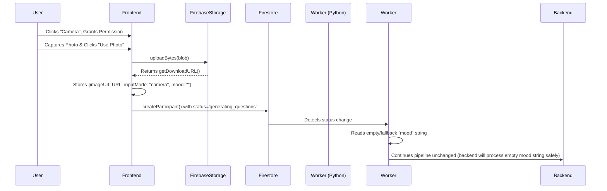

# Revised Camera Upload Feature Plan

## 1. Current Flow Summary
1.  **UI**: In `MoodStep.tsx`, the user chooses from predefined mood emojis.
2.  **State**: The selected mood (e.g., "Inspired") is saved in the frontend `OnboardingContext`.
3.  **Firestore**: The user clicks "Continue", triggering `createParticipant` in `useParticipant.ts`. This creates a document with `mood: "Inspired"` and `status: "generating_questions"`.
4.  **Backend**: The python worker `firestore_worker.py` detects the `generating_questions` status and passes the `mood` string to the `/api/generate_questions` endpoint.

## 2. Camera Implementation (Step-by-Step)
To support camera capture natively in the React browser environment without external libraries:

1. **Request Permission & Stream**:
   - Create a `useState` for the `stream`, `capturedImage`, and `permissionState`.
   - On component mount or when the user clicks "Start Camera", call `navigator.mediaDevices.getUserMedia({ video: { facingMode: "user" } })` to request the front/selfie camera.
2. **Display Live Preview**:
   - Handle the returned `MediaStream` by attaching it to a `<video autoPlay playsInline>` element's `srcObject` property. 
   - Ensure the UI constraints match the app's aesthetic (e.g., `object-fit: cover`, `aspect-ratio: 3/4`, `rounded-[2rem]`).
3. **Capture Frame**:
   - When the user clicks "Capture", draw the current video frame onto a hidden `<canvas>` using `canvas.getContext('2d').drawImage(videoElement, 0, 0, width, height)`.
   - Downscale the image on the canvas to save bandwidth (e.g., max 800px width/height).
   - Convert the canvas to a Blob using `canvas.toBlob((blob) => { ... }, 'image/jpeg', 0.8)`.
4. **Interactive Preview**:
   - Immediately stop the video tracks (`stream.getTracks().forEach(t => t.stop())`) to save battery and camera light.
   - Show the captured image using an `` tag with `src={URL.createObjectURL(blob)}`.
   - Provide "Retake" (re-initializes the camera stream) and "Use Photo" buttons.
5. **Component State Management**:
   - `useState` hooks manage the UI transitions (`'idle' | 'camera_active' | 'preview' | 'uploading'`).

## 3. Upload Flow
1. **Destination**: Google Cloud Storage via Firebase Storage SDK.
2. **When it Happens**: The upload triggers *after* the user clicks "Use Photo" but *before* the participant data is written to Firestore.
3. **Execution Steps**:
   - Initialize Firebase Storage: `const storage = getStorage();`
   - Create a unique reference: `const imgRef = ref(storage, 'participants/${roomId}_${Date.now()}.jpg');`
   - Upload the Blob: `const snapshot = await uploadBytes(imgRef, capturedImageBlob);`
   - Retrieve the URL: `const downloadUrl = await getDownloadURL(snapshot.ref);`
4. **State Update**: Save `downloadUrl` and update `inputMode: 'camera'` in the global `OnboardingContext`.

## 4. Firestore Schema Updates
The schema natively supports the new mode without breaking the worker. 

```javascript
{
  username: "user123",
  pronoun: "they/them",
  status: "generating_questions",
  
  // --- UPDATED FIELDS ---
  inputMode: "camera",  // Indicates how the user provided their context. If mood chosen, this is "mood".
  imageUrl: "https://firebasestorage.googleapis.com/.../img.jpg", // The Firebase Storage URL. Only present if camera used.
  mood: "",  // Backend STRICTLY expects a string to prevent crashes. For camera mode, pass an empty string `""`.
}
```

## 5. Data Flow


## 6. Edge Cases
*   **User Denys Camera Permission**: Catch the `NotAllowedError`. Display a fallback UI ("Camera access denied. Please check site permissions.") and a button to return to the Mood selection.
*   **Camera Not Available (Hardware issue)**: Catch `NotFoundError`. Provide the same fallback UI to redirect them to the manual Mood selection.
*   **Upload Fails / No Internet**: Wrap the `uploadBytes` in a try/catch. If it fails, show a toast/error message and keep the user on the preview screen so they can retry the upload without recapturing the photo.
*   **Multiple Retakes Memory Leak**: Ensure previous object URLs are revoked (`URL.revokeObjectURL()`) when a user retakes photos multiple times to prevent frontend memory bloating.
*   **Mobile vs Desktop Differences**: The browser API `facingMode: "user"` usually guarantees the front/selfie camera on mobile. On desktop/laptops, it intelligently picks the default webcam.

## 7. Tradeoffs & Risks
* **Backend Processing Degradation**: Because the frontend is strictly forbidden from integrating AI to process the image, the backend AI matching/question generator will temporarily degrade for users who choose the camera path (they will pass an empty `mood`) *until* the Python backend is updated to download and parse `imageUrl`.
* **Storage Latency vs. Firebase Limits**: Uploading images directly from mobile devices adds UI latency (2-5 seconds). Furthermore, storing thousands of uncompressed images can stress Firebase quotas. *Mitigation*: Aggressively scale down the image using the Canvas API step (`max-width: 800px`, `quality: 0.7`) to keep blob sizes firmly under 150KB.

## 8. Migration Strategy
1. **Phase 1 (No impact)**: Implement the `<Camera />` React component locally in `MoodStep.tsx` behind a state toggle. It connects to the user's camera but does nothing.
2. **Phase 2 (Shadow Write)**: Perform the Firebase Storage `uploadBytes` and attach `imageUrl` and `inputMode: "camera"` to the context object, sending an empty string `""` for `mood`.
3. **Phase 3 (Live)**: `firestore_worker.py` only cares that a `mood` string field exists (even if empty). The worker won't crash. Old users using the mood emojis continue unaltered. New users immediately start writing `imageUrl` for backend ingestion once the backend sprint begins.
